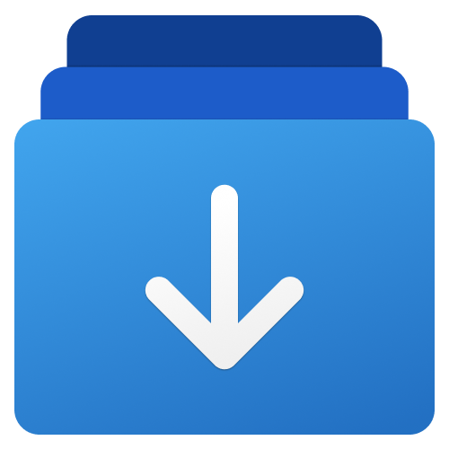

<a name="readme-top"></a>

<div align="center">



<h1 align="center">AI Downloader</h1>

A dedicated downloader for downloading AI model files, which can stably and reliably download your favorite models from Hugging Face and Civitai. It supports both command line and UI, and is currently only available on Windows.

English · [简体中文](./README.zh-CN.md)

<!-- SHIELD GROUP -->

[![][github-release-shield]][github-release-link]
[![][github-releasedate-shield]][github-releasedate-link]
[![][github-contributors-shield]][github-contributors-link]
[![][github-forks-shield]][github-forks-link]
[![][github-stars-shield]][github-stars-link]
[![][github-issues-shield]][github-issues-link]
[![][github-license-shield]][github-license-link]

</div>

> \[!WARNING]
>
> The application is developed based on .NET 8, it is not a cross-platform application, and is currently only available on **Windows**. For users below Windows 10 19043, please use the command line instead of the UI.

<details>
<summary><kbd>Table of contents</kbd></summary>

#### TOC

- [✨ Feature Overview](#-feature-overview)
  - [`1` CLI \& APP](#1-cli--app)
  - [`2` Built-in Aria2](#2-built-in-aria2)
- [🎛️ Environment Support](#️-environment-support)
- [🛠️ CLI Instruction Manual](#️-cli-instruction-manual)
    - [`1` Install](#1-install)
    - [`2` Download Hugging Face Model](#2-download-hugging-face-model)
    - [`3` Download Civitai Model](#3-download-civitai-model)
    - [`4` Resume Download](#4-resume-download)
    - [`5` Configuration](#5-configuration)
- [🔗 Links](#-links)

####

</details>

## ✨ Feature Overview

### `1` CLI & APP

The application, with aria2 at its core, offers two modes of use:

- Command line
- UI

This caters to the needs of different users.

Both the command line and UI have simple localization support (supporting `en-US` and `zh-CN`), and can switch automatically according to the current system language.

> \[!TIP]
>
> The UI is based on the Windows App SDK, which requires your system version to be Windows 10 19043 and above. It is highly recommended to download and install from the Microsoft Store.

### `2` Built-in Aria2

I have to say, the sole motivation for building this tool was that I couldn't find a convenient, reliable download tool to download entire repositories from hugging face. Either there's no progress indication, or the robustness is too poor.

My technical skills aren't great, but [aria2](https://github.com/aria2/aria2) has left a good impression on me in the past, so I chose to build a simple download tool based on it.

The download has the following features:

1. Customizable download directory
2. Support for resuming downloads
3. Complete progress display
4. Ability to operate on individual items, pause/resume/cancel **(App only)**

Both CLI and APP come with a built-in `1.3.7` **aria2c.exe**, no additional download required, trying to be as plug and play as possible.

## 🎛️ Environment Support

|||
|-|-|
|Framework|.NET 8|
|UI Framework|Windows App SDK 1.5|
|System Requirements|`CLI`: Windows 7 and above, `APP`: Windows 10 19043 and above|

## 🛠️ CLI Instruction Manual

#### `1` Install

> \[!WARNING]
>
> CLI relies on .NET 8 framework, please make sure that `.NET 8 Desktop Runtime` or `SDK` is installed on your device.
> You can download `.NET SDK` or `.NET Desktop Runtime` at [Download .NET 8.0](https://dotnet.microsoft.com/en-us/download/dotnet/8.0).

1. Download the latest `AIDownloader-CLI.zip` from the Release list of the repository.
2. Unzip the downloaded package to a directory you prefer.
3. Add the unzipped directory to the system or user's **PATH** environment variable.
4. Open the command line you are familiar with and enter `ai-downloader`.

#### `2` Download Hugging Face Model

> \[!TIP]
>
> To use this tool to download models from Hugging Face, you need to prepare your access token in advance. The specific acquisition method can be referred to: [User Access Tokens](https://huggingface.co/docs/hub/security-tokens)

1. choose `Hugging Face`
2. Enter the model ID you need to download.
3. Enter the Hugging Face access token.
4. Choose the source of Hugging Face models, you can choose from the official source or the mirror site in China.
5. Enter the folder to store the model.

> \[!TIP]
>
> The model ID format is like: `author/model`, for example, if you want to download the Llama 3 8B model, the model ID you need to enter is: `meta-llama/Meta-Llama-3-8B`. The application accesses the Hugging Face API to get the model download list based on this ID and your token.

> \[!WARNING]
>
> The term "save folder" refers to the parent folder where the model is stored. The application will create a subfolder with the same name as the model within this folder to serve as the directory for storing the model files.
> 
> For example, you specified `C:\MyFolder` as the save folder, then after you download the Llama 3 8B model, the actual model file path is `C:\MyFolder\Meta-Llama-3-8B`.

If everything is fine, you can now get the file list from the model repository. Please select the files you need to download according to the command line prompts (all selected by default).

Then... hit `Enter` and wait for the download.

*During the download process, you can press `Ctrl` + `C` at any time to stop the download.*

#### `3` Download Civitai Model

> \[!TIP]
>
> Similar to Hugging Face, Civitai also needs an access token (*but this is not mandatory, which is only needed when accessing some models that require authorized downloads.*) For information on how to obtain an access token, refer to the document: [Civitai's Guide to Downloading via API](https://education.civitai.com/civitais-guide-to-downloading-via-api/)

1. Select **Civitai**.
2. Enter the model ID (number) or the link to the model page (the application will extract the model ID).
3. Enter the token, optional, press enter to skip.
4. Enter the folder where you need to save.

> \[!WARNING]
>
> Unlike Hugging Face, Civitai usually downloads a single model file, so there is no need to create a new subfolder. Therefore, the application will directly download the model to the specified directory.

Once the above configuration is ready, the application will attempt to retrieve the version list of the specified model.

If the number of versions is more than 1, then you will see a version list, from which you can choose the model version you need to download.

If the number of downloadable files for the specified version is more than 1, then you will see a file list, select the files you need to download (all are selected by default).

Next, press `Enter` and wait for the download to complete!

#### `4` Resume Download

The application is based on aria2, so it has the ability to resume interrupted downloads. The management and recovery of download progress are controlled by aria2.

If for some reason, you interrupt the download.

Recovery is also easy, just run it again.

Make sure your model ID and save path are the same as before.

> \[!TIP]
>
> The foundation of resuming a broken download is that you still retain the file downloaded last time, as well as the binary file with the suffix `.aria2` in the same directory, which saves your download progress.
> 
> If the corresponding file is deleted, you need to download it again.

#### `5` Configuration

Repeating input each time can be rather cumbersome. CLI supports the use of configuration files to fix optional parameters, simplifying the input each time it is called.

You can create a config.json file in the CLI directory and paste the following code into the file, modifying the properties.

```json
{
  "hf_token": "",
  "hf_save_folder": "",
  "hf_backup_folders": {
    "folder1": "path1",
    "folder2": "path2"
  },
  "hf_uri_type": "{official} or {mirror}",

  "civitai_token": "",
  "civitai_save_folder": "",
  "civitai_backup_folders": {
    "folder1": "path1",
    "folder2": "path2"
  }
}
```

1. `*_token`  
   This is the access token for the corresponding service.
2. `*_save_folder` and `*_backup_folders`  
   These are a pair of mutually exclusive attributes.  
   - If the model you download will only be saved in a certain folder, then fill in `*_save_folder`, and the CLI will download the model of the corresponding service to this folder.
   - If you have multiple optional locations, such as downloading the model required for SD-WebUI (checkpoint, lora...), you can fill in the corresponding path into `*_backup_folders`, where the `key` is the readable name of the folder path, and the `value` is its absolute path. When running the CLI, you can choose from the defined folder list.

## 🔗 Links

- [Spectre.Console](https://spectreconsole.net)
- [Windows App SDK](https://github.com/microsoft/WindowsAppSDK)
- [aria2](https://github.com/aria2/aria2)
- [Aria2.NET](https://github.com/rogerfar/Aria2.NET)
- [CommunityToolkit](https://github.com/CommunityToolkit)
- [Hugging Face](https://huggingface.co)
- [Hugging Face Mirror](https://hf-mirror.com)
- [Civitai](https://civitai.com)

<!-- LINK GROUP -->
[github-contributors-link]: https://github.com/Richasy/AIDownloader/graphs/contributors
[github-contributors-shield]: https://img.shields.io/github/contributors/Richasy/AIDownloader?color=c4f042&labelColor=black&style=flat-square
[github-forks-link]: https://github.com/Richasy/AIDownloader/network/members
[github-forks-shield]: https://img.shields.io/github/forks/Richasy/AIDownloader?color=8ae8ff&labelColor=black&style=flat-square
[github-issues-link]: https://github.com/Richasy/AIDownloader/issues
[github-issues-shield]: https://img.shields.io/github/issues/Richasy/AIDownloader?color=ff80eb&labelColor=black&style=flat-square
[github-license-link]: https://github.com/Richasy/AIDownloader/blob/main/LICENSE
[github-license-shield]: https://img.shields.io/github/license/Richasy/AIDownloader?color=white&labelColor=black&style=flat-square
[github-release-link]: https://github.com/Richasy/AIDownloader/releases
[github-release-shield]: https://img.shields.io/github/v/release/Richasy/AIDownloader?color=369eff&labelColor=black&logo=github&style=flat-square
[github-releasedate-link]: https://github.com/Richasy/AIDownloader/releases
[github-releasedate-shield]: https://img.shields.io/github/release-date/Richasy/AIDownloader?labelColor=black&style=flat-square
[github-stars-link]: https://github.com/Richasy/AIDownloader/network/stargazers
[github-stars-shield]: https://img.shields.io/github/stars/Richasy/AIDownloader?color=ffcb47&labelColor=black&style=flat-square