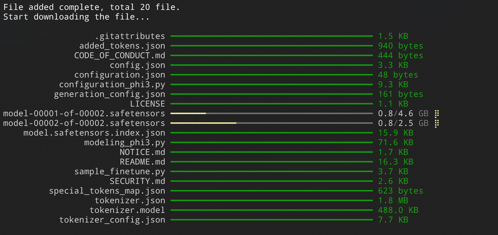

<a name="readme-top"></a>

<div align="center">


<h1 align="center">Rodel Downloader</h1>

A dedicated downloader for downloading AI model files, which can stably and reliably download your favorite models from [Hugging Face](https://huggingface.co), [Model Scope](https://www.modelscope.cn) and [Civitai](https://civitai.com). It supports both command line and UI, and is currently only available on Windows.

English · [简体中文](./README.zh-CN.md)

<!-- SHIELD GROUP -->

[![][github-release-shield]][github-release-link]
[![][github-releasedate-shield]][github-releasedate-link]
[![][github-contributors-shield]][github-contributors-link]
[![][github-forks-shield]][github-forks-link]
[![][github-stars-shield]][github-stars-link]
[![][github-issues-shield]][github-issues-link]
[![][github-license-shield]][github-license-link]

</div>

> \[!WARNING]
>
> The application is developed based on .NET 8, it is not a cross-platform application, and is currently only available on **Windows**. For users below Windows 10 19043, please use the command line instead of the UI.

<details>
<summary><kbd>Table of contents</kbd></summary>

#### TOC

- [✨ Feature Overview](#-feature-overview)
  - [`1` CLI \& APP](#1-cli--app)
  - [`2` Built-in Aria2](#2-built-in-aria2)
- [🎛️ Environment Support](#️-environment-support)
- [🛠️ CLI Instruction Manual](#️-cli-instruction-manual)
    - [`1` Install](#1-install)
    - [`2` Interactive Commands](#2-interactive-commands)
      - [Screenshots of the interactive interface](#screenshots-of-the-interactive-interface)
    - [`3` Standard Commands](#3-standard-commands)
      - [Example](#example)
    - [`4` Configuration and Saving](#4-configuration-and-saving)
      - [Overview of Access Token Acquisition](#overview-of-access-token-acquisition)
    - [`5` Resume from Breakpoint](#5-resume-from-breakpoint)
- [🪄 Application Manual](#-application-manual)
    - [`1` Download and Installation](#1-download-and-installation)
    - [`2` Configuration](#2-configuration)
    - [`3` Download Model](#3-download-model)
- [🔗 Links](#-links)

####

</details>

## ✨ Feature Overview

### `1` CLI & APP

The application, with aria2 at its core, offers two modes of use:

- Command line
- UI

This caters to the needs of different users.

Both the command line and UI have simple localization support (supporting `en-US` and `zh-CN`), and can switch automatically according to the current system language.

> \[!TIP]
>
> The UI is based on the Windows App SDK, which requires your system version to be Windows 10 19043 and above. It is highly recommended to download and install from the Microsoft Store.

<p align="left">
  <a title="Get it from Microsoft Store" href="https://www.microsoft.com/store/apps/9PJDBLQ239JB?launch=true&mode=full" target="_blank">
    <picture>
      <source srcset="https://get.microsoft.com/images/en-US%20light.svg" media="(prefers-color-scheme: dark)" />
      <source srcset="https://get.microsoft.com/images/en-US%20dark.svg" media="(prefers-color-scheme: light), (prefers-color-scheme: no-preference)" />
      
    </picture>
  </a>
</p>

### `2` Built-in Aria2

I have to say, the sole motivation for building this tool was that I couldn't find a convenient, reliable download tool to download entire repositories from hugging face. Either there's no progress indication, or the robustness is too poor.

My technical skills aren't great, but [aria2](https://github.com/aria2/aria2) has left a good impression on me in the past, so I chose to build a simple download tool based on it.

The download has the following features:

1. Customizable download directory
2. Support for resuming downloads
3. Complete progress display
4. Ability to operate on individual items, pause/resume/cancel **(App only)**

Both CLI and APP come with a built-in `1.3.7` **aria2c.exe**, no additional download required, trying to be as plug and play as possible.

## 🎛️ Environment Support

|||
|-|-|
|Framework|.NET 8|
|UI Framework|Windows App SDK 1.5|
|System Requirements|`CLI`: Windows 7 and above, `APP`: Windows 10 19043 and above|

## 🛠️ CLI Instruction Manual

#### `1` Install

> \[!WARNING]
>
> CLI relies on .NET 8 framework, please make sure that `.NET 8 Desktop Runtime` or `SDK` is installed on your device.
> You can download `.NET SDK` or `.NET Desktop Runtime` at [Download .NET 8.0](https://dotnet.microsoft.com/en-us/download/dotnet/8.0).

1. Open PowerShell
2. Enter the command
   ```powershell
   dotnet-tool install --global Rodel.cli
   ```
3. After the installation is complete, enter the command `rodel` to enter the interactive command interface
4. You can also enter the command `rodel --help` to view detailed parameter definitions

#### `2` Interactive Commands

The CLI defaults to an interactive mode to guide you through the download process.

After installation, you can simply enter `rodel` to access the interactive interface.

The basic download steps are as follows:

1. Choose the model hosting service. Currently, `Hugging Face / HF-Mirror`, `Civitai`, and `Model Scope` are supported.
2. Enter the model ID you want to download. This model ID is usually provided by the hosting service.
3. The CLI will search for the repository and download file list corresponding to the model ID. Once found, it will be listed and you can freely choose which files to download.
4. Start downloading. The CLI will provide progress tips. You can wait for the download to complete or press `Ctrl` + `C` at any time to interrupt the download.

##### Screenshots of the interactive interface

*The following image uses the `LLM-Research/Phi-3-mini-128k-instruct` model from the Model Scope community as an example*




#### `3` Standard Commands

The CLI also accepts another mode of operation, which is the regular parameter call.

When you need to use parameter calls, you must first disable the interactive mode, which is `-n` or `--no-interaction`.

After that, you need to provide the specified parameters.

```
  --ignore-config         (Default: false) Ignore the local configuration and use the default process for interaction.

  --clean-up              (Default: false) Kill all aria2c processes before starting the download.

  --edit-config           (Default: false) Edit the configuration file.

  -n, --no-interaction    (Default: false) Disable interaction and use the command-line parameters.

  -m, --model-id          The model ID to download.

  -s, --service           (Default: hf) The service to download the model from. Support hf | civitai | ms

  --use-hf-mirror         (Default: false) Use the hf-mirror (https://hf-mirror.com/) for downloading. Only available
                          when service is hf.

  -t, --token             (Default: ) The token to use for authentication.

  -d, --save-dir          (Default: ) The directory to save the model to.

  -i, --include           (Default: ) The files to include in the download.

  -e, --exclude           (Default: ) The files to exclude in the download.

  --help                  Display this help screen.

  --version               Display version information.
```

##### Example

Download the `microsoft/Phi-3-mini-4k-instruct` model from Hugging Face:

```powershell
rodel -n -m "microsoft/Phi-3-mini-4k-instruct" -s hf --token "hf-xxxxxxxx" -d "C:\Models"
```

#### `4` Configuration and Saving

Repeated input can be quite troublesome. The CLI supports using a configuration file to fix optional parameters, simplifying input each time it is called.

Enter the following command in the command line:

```powershell
rodel --edit-config
```

The application will call the default editor to open the configuration file `config.json` (if it does not exist, create a new one), the specific parameters are as follows:

```json
{
  "hf_token": "",
  "hf_save_folder": "",
  "hf_backup_folders": {
    "folder1": "path1",
    "folder2": "path2"
  },
  "hf_uri_type": "{official} or {mirror}",

  "civitai_token": "",
  "civitai_save_folder": "",
  "civitai_backup_folders": {
    "folder1": "path1",
    "folder2": "path2"
  },

  "ms_token": "",
  "ms_save_folder": "",
  "ms_backup_folders": {
    "folder1": "path1",
    "folder2": "path2"
  }
}
```

1. `*_token`
   This is the access token for the corresponding service. Here, `hf` stands for Hugging Face, and `ms` stands for Model Scope.
2. `*_save_folder` and `*_backup_folders`
   These are a pair of mutually exclusive properties, and the application prefers to use `*_save_folder`.
   - If the model you download will only be saved in a specific folder, fill in `*_save_folder`, and the CLI will download the model of the corresponding service to this folder.
   - If you have multiple optional locations, such as downloading the models required for SD-WebUI (check point, lora...), you can fill in the corresponding paths into `*_backup_folders`, where `key` is the readable name of the folder path, and `value` is its absolute path. When running the CLI, you can choose from the defined folder list.
   
   > \[!WARNING]
   >
   > The "save folder" means the parent folder for storing the model. For `Hugging Face` and `Model Scope`, the application will create a subfolder with the same name as the model in this folder as the directory for storing model files.
   >
   > For example, if you specify `C:\MyFolder` as the save folder, then after you download the Llama 3 8B model, the actual model file folder path is `C:\MyFolder\Meta-Llama-3-8B`.
   >
   > **But for `Civitai`, since it is usually a single file download, the application will not create a same-name subfolder, but directly download the model file to the specified storage directory.**

##### Overview of Access Token Acquisition

|||
|-|-|
|Hugging Face| [User Access Tokens](https://huggingface.co/docs/hub/security-tokens) |
|Civitai | [Civitai's Guide to Downloading via API](https://education.civitai.com/civitais-guide-to-downloading-via-api/) |
|Model Scope|[Access Token](https://www.modelscope.cn/my/myaccesstoken), `Model Scope Personal Center -> Access Token`|

#### `5` Resume from Breakpoint

The application is based on aria2, so it has the ability to resume from breakpoints. The management and recovery of download progress is controlled by aria2.

If for some reason, you interrupt the download.

Recovery is also simple, just enter the same parameters as the last call.

Make sure your `model ID`, `save path`, and `hosting service` are the same as before.

> \[!TIP]
>
> The basis for resuming from a breakpoint is that you still have the files from the last download, and the binary files with the suffix `.aria2` in the same directory, which save your download progress.
> 
> If the corresponding files are deleted, you need to download again.

## 🪄 Application Manual

#### `1` Download and Installation

You can directly download and install it from the Microsoft Store, and it can be automatically updated afterwards.

<p align="left">
  <a title="Get it from Microsoft Store" href="https://www.microsoft.com/store/apps/9PJDBLQ239JB?launch=true&mode=full" target="_blank">
    <picture>
      <source srcset="https://get.microsoft.com/images/en-US%20light.svg" media="(prefers-color-scheme: dark)" />
      <source srcset="https://get.microsoft.com/images/en-US%20dark.svg" media="(prefers-color-scheme: light), (prefers-color-scheme: no-preference)" />
      
    </picture>
  </a>
</p>

#### `2` Configuration

The first time you start the application, the application will guide you to do some configurations, including filling in the tokens of services such as `Hugging Face`, `Civitai`, `Model Scope` and the corresponding service save folders, etc.

<details>
<summary><kbd>Screenshot</kbd></summary>


</details>

> \[!TIP]
>
> If you don't need the corresponding service, just click `Next` to skip the configuration.

If you have previously used CLI and set up your own [configuration file](#4-configuration-and-saving), then you can directly import the configuration at this step.

<details>
<summary><kbd>Screenshot</kbd></summary>


</details>

All initial configurations can be changed later on the application settings page.

<details>
<summary><kbd>Screenshot</kbd></summary>


</details>

#### `3` Download Model

After opening the application, you can switch different model hosting services in the navigation bar on the top right.

Click the `Download Model` button to pop up the download dialog box of the corresponding service.

<details>
<summary><kbd>Screenshot</kbd></summary>


</details>

Follow the prompts to enter the model's Id and select the save folder. You can also click `Select Others` to temporarily select a folder for storage.

Afterwards, you can view the file list of the corresponding repository, select the files you need to download, and click download.

<details>
<summary><kbd>Screenshot</kbd></summary>


</details>

The application will add download tasks one by one, and you can observe the download progress and download speed in real time on the interface.

<details>
<summary><kbd>Screenshot</kbd></summary>


</details>

You can pause or resume a task at any time.

> \[!WARNING]
>
> Unlike regular downloaders, the application does not keep your history.
>
> If you close a downloading task for some reason, don't worry, you can still resume the download progress, but you need to recreate the same download task (the same service, the same model ID, the same save path).
> 
> On this point, the application does have a record, when you create a download task again, the application will use your last download configuration.

## 🔗 Links

- [Spectre.Console](https://spectreconsole.net)
- [Windows App SDK](https://github.com/microsoft/WindowsAppSDK)
- [aria2](https://github.com/aria2/aria2)
- [Aria2.NET](https://github.com/rogerfar/Aria2.NET)
- [CommunityToolkit](https://github.com/CommunityToolkit)
- [Hugging Face](https://huggingface.co)
- [Hugging Face Mirror](https://hf-mirror.com)
- [Civitai](https://civitai.com)
- [Model Scope](https://www.modelscope.cn)

<!-- LINK GROUP -->
[github-contributors-link]: https://github.com/Richasy/Rodel/graphs/contributors
[github-contributors-shield]: https://img.shields.io/github/contributors/Richasy/Rodel?color=c4f042&labelColor=black&style=flat-square
[github-forks-link]: https://github.com/Richasy/Rodel/network/members
[github-forks-shield]: https://img.shields.io/github/forks/Richasy/Rodel?color=8ae8ff&labelColor=black&style=flat-square
[github-issues-link]: https://github.com/Richasy/Rodel/issues
[github-issues-shield]: https://img.shields.io/github/issues/Richasy/Rodel?color=ff80eb&labelColor=black&style=flat-square
[github-license-link]: https://github.com/Richasy/Rodel/blob/main/LICENSE
[github-license-shield]: https://img.shields.io/github/license/Richasy/Rodel?color=white&labelColor=black&style=flat-square
[github-release-link]: https://github.com/Richasy/Rodel/releases
[github-release-shield]: https://img.shields.io/github/v/release/Richasy/Rodel?color=369eff&labelColor=black&logo=github&style=flat-square
[github-releasedate-link]: https://github.com/Richasy/Rodel/releases
[github-releasedate-shield]: https://img.shields.io/github/release-date/Richasy/Rodel?labelColor=black&style=flat-square
[github-stars-link]: https://github.com/Richasy/Rodel/network/stargazers
[github-stars-shield]: https://img.shields.io/github/stars/Richasy/Rodel?color=ffcb47&labelColor=black&style=flat-square