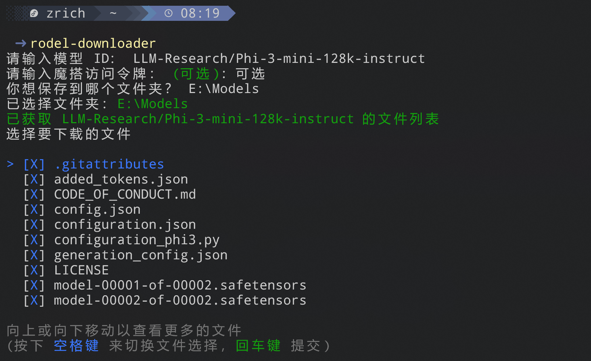
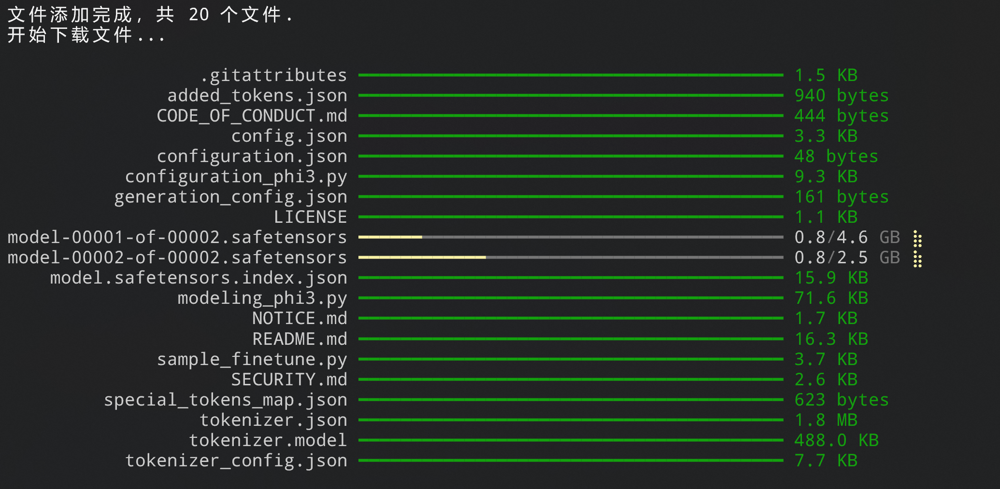
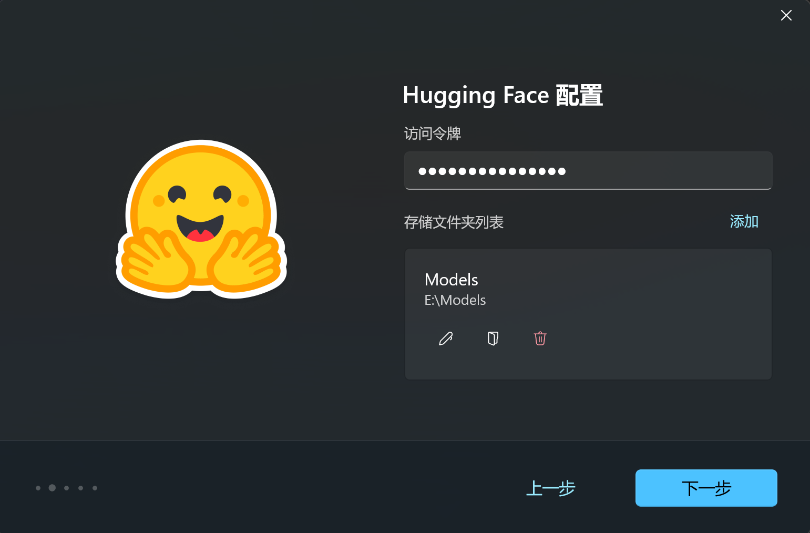
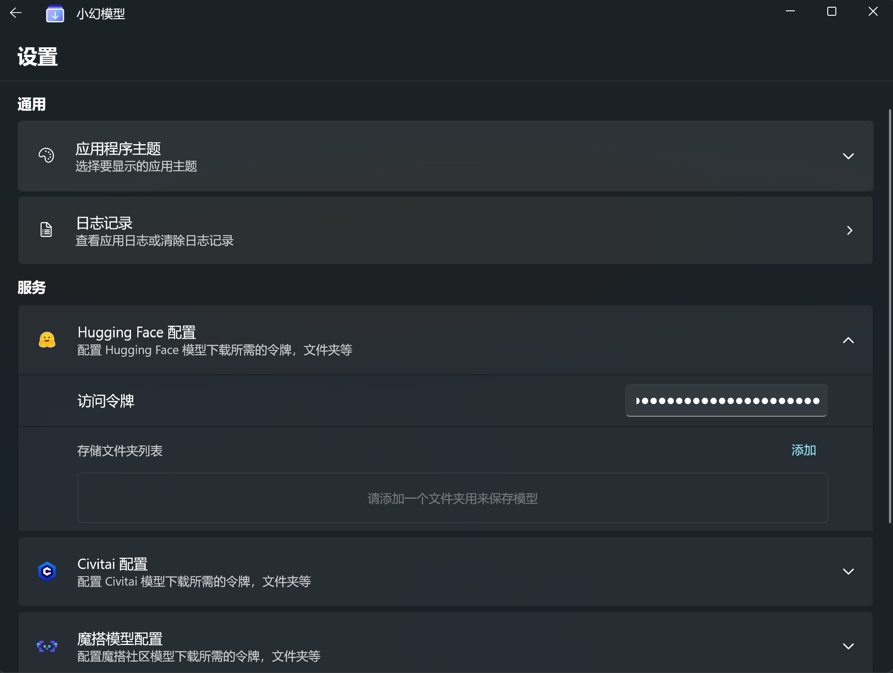
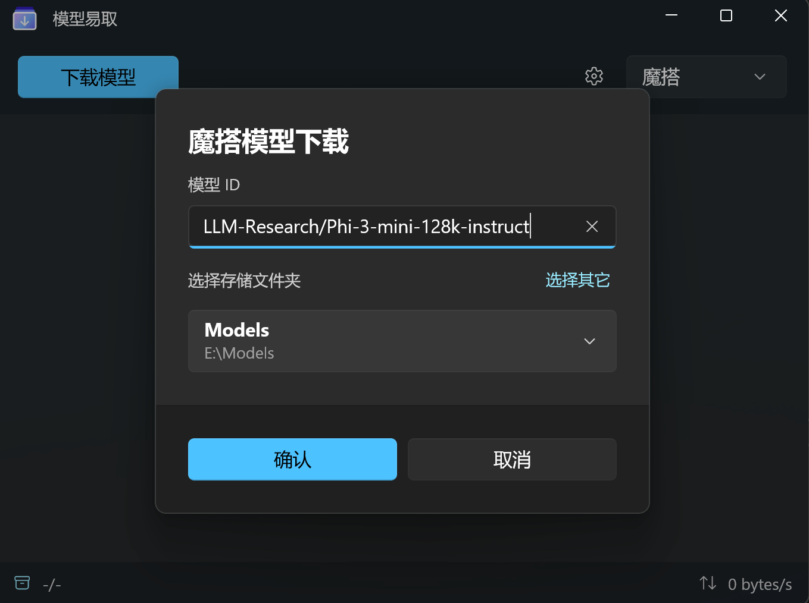
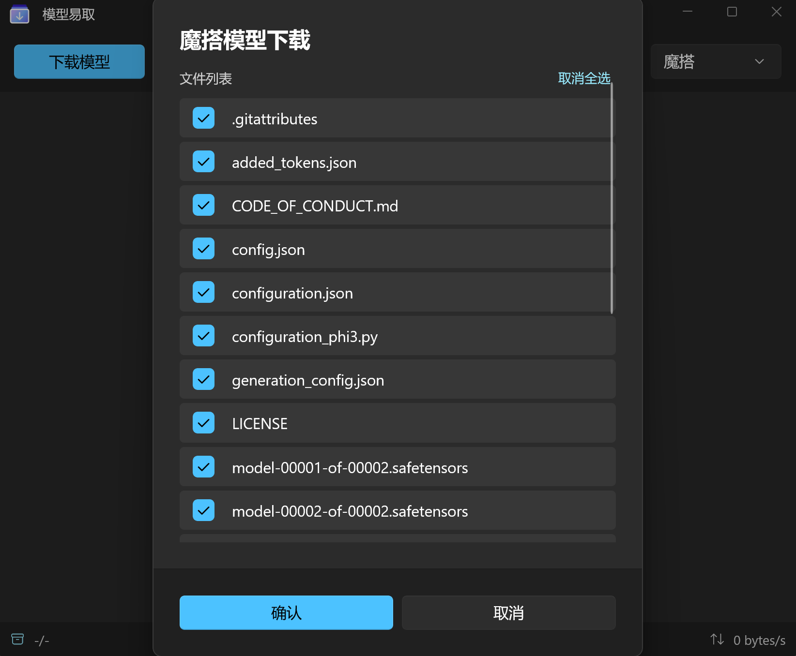
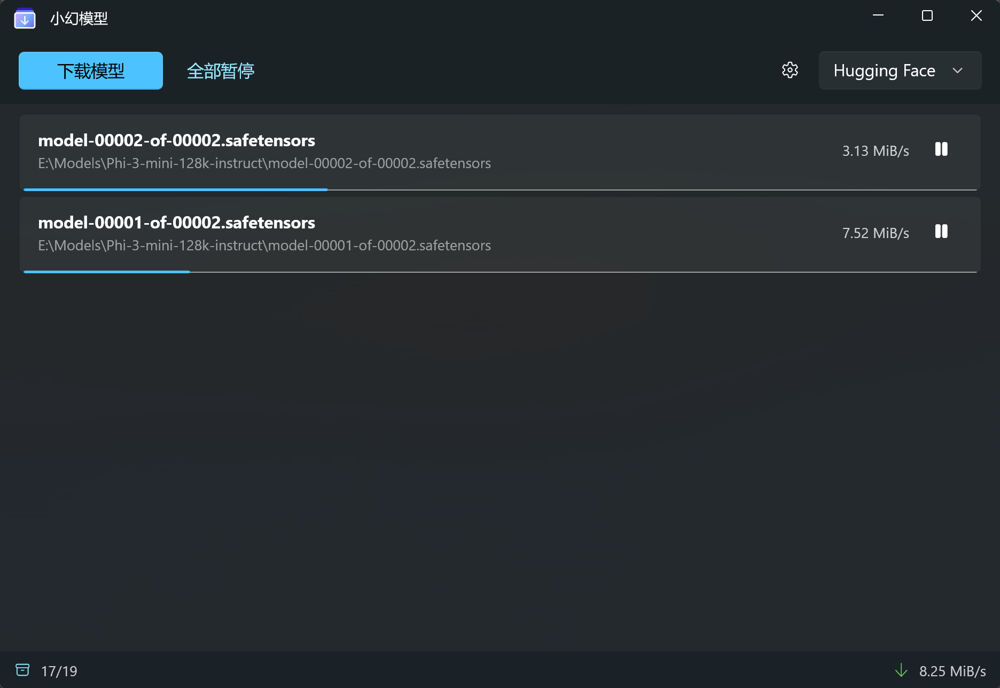

<a name="readme-top"></a>

<div align="center">


<h1 align="center">小幻模型</h1>

一个专用的AI模型文件下载器，可以稳定可靠地从 [Hugging Face](https://huggingface.co)，[Model Scope](https://www.modelscope.cn) 和 [Civitai](https://civitai.com) 中下载你喜欢的模型。它支持命令行和用户界面，目前只在 Windows 上可用。

[English](./README.md) · 简体中文

<!-- SHIELD GROUP -->

[![][github-release-shield]][github-release-link]
[![][github-releasedate-shield]][github-releasedate-link]
[![][github-contributors-shield]][github-contributors-link]
[![][github-forks-shield]][github-forks-link]
[![][github-stars-shield]][github-stars-link]
[![][github-issues-shield]][github-issues-link]
[![][github-license-shield]][github-license-link]

</div>

> \[!WARNING]
>
> 该应用程序是基于 .NET 8 开发的，它不是一个跨平台的应用程序，目前只在 **Windows** 上可用。对于Windows 10 19043 以下的用户，请使用命令行，而不是用户界面。

<details>
<summary><kbd>目录</kbd></summary>

#### TOC

- [✨ 功能概览](#-功能概览)
  - [`1` 命令行 \& 用户界面](#1-命令行--用户界面)
  - [`2` 内置 Aria2](#2-内置-aria2)
- [🎛️ 环境支持](#️-环境支持)
- [🛠️ 命令行说明书](#️-命令行说明书)
    - [`1` 下载及安装](#1-下载及安装)
    - [`2` 交互式命令](#2-交互式命令)
      - [交互界面截图](#交互界面截图)
    - [`3` 标准命令](#3-标准命令)
      - [示例](#示例)
    - [`4` 配置及保存](#4-配置及保存)
      - [服务令牌获取概览](#服务令牌获取概览)
    - [`5` 断点续传](#5-断点续传)
- [🪄 应用说明书](#-应用说明书)
    - [`1` 下载及安装](#1-下载及安装-1)
    - [`2` 配置](#2-配置)
    - [`3` 下载模型](#3-下载模型)
- [🔗 链接](#-链接)

####

</details>

## ✨ 功能概览

### `1` 命令行 & 用户界面

这款应用以 aria2 为核心，提供了两种使用模式：

- 命令行
- 用户界面

这满足了不同用户的需求。

无论是命令行还是用户界面，都支持简单的本地化（支持 `en-US` 和 `zh-CN` ），并且可以根据当前系统语言自动切换。

> \[!TIP]
>
> 用户界面基于 Windows App SDK，要求你的系统版本为 Windows 10 19043 及以上。强烈建议从 Microsoft Store 下载和安装。

<p align="left">
  <a title="从 Microsoft Store 中获取" href="https://www.microsoft.com/store/apps/9PJDBLQ239JB?launch=true&mode=full" target="_blank">
    <picture>
      <source srcset="https://get.microsoft.com/images/zh-CN%20light.svg" media="(prefers-color-scheme: dark)" />
      <source srcset="https://get.microsoft.com/images/zh-CN%20dark.svg" media="(prefers-color-scheme: light), (prefers-color-scheme: no-preference)" />
      
    </picture>
  </a>
</p>

### `2` 内置 Aria2

说实话，构建这个工具的唯一动机是我找不到一个方便、可靠的下载工具来从 Hugging Face 下载整个仓库。要么没有进度指示，要么鲁棒性太差。

我的技术能力比较一般，[aria2](https://github.com/aria2/aria2) 在过去给我留下了很好的印象，所以我选择基于它构建一个简单的下载工具。

项目具有以下特性：

1. 可定制的下载目录
2. 支持断点续传
3. 完整的进度显示
4. 能够对单个项目进行操作，暂停/恢复/取消 **（仅限应用程序）**

无论是 CLI 还是 APP，都内置了 `1.3.7` 版本的 **aria2c.exe** ，无需额外下载，尽可能地做到即插即用。

## 🎛️ 环境支持

|||
|-|-|
|开发框架|.NET 8|
|UI 框架|Windows App SDK 1.5|
|系统要求|`CLI`: Windows 7 及以上, `APP`: Windows 10 19043 及以上|

## 🛠️ 命令行说明书

#### `1` 下载及安装

> \[!WARNING]
>
> CLI 依赖 .NET 8 框架，请确保你的设备上安装了 .NET 8 Desktop Runtime 或 SDK。
> 你可以在 [下载 .NET 8.0](https://dotnet.microsoft.com/zh-cn/download/dotnet/8.0) 中下载 .NET SDK 或者 .NET Desktop Runtime。

1. 打开 PowerShell
2. 输入命令
   ```powershell
   dotnet-tool install --global Rodel.cli
   ```
3. 安装完成后，输入命令 `rodel` 进入交互式命令界面
4. 你也可以输入命令 `rodel --help` 查看详细的参数定义

#### `2` 交互式命令

CLI 默认采用交互的形式引导你完成下载。

在安装完成后，你可以简单地输入 `rodel` 进入交互式界面。

基本的下载步骤如下：

1. 选择模型托管服务，目前支持 `Hugging Face / HF-Mirror`，`Civitai` 和 `魔搭（Model Scope）`。
2. 输入你要下载的模型 ID，该模型 ID 通常由托管服务提供。
3. CLI 会查找模型 ID 对应的仓库及下载文件列表，找到后会列出来，你可以自由选择下载哪些文件。
4. 开始下载，CLI 会提供进度提示。你可以等待下载完成，也可以随时按下 `Ctrl` + `C` 中断下载。

##### 交互界面截图

*下图以魔搭社区的 `LLM-Research/Phi-3-mini-128k-instruct` 模型为例*





#### `3` 标准命令

CLI 也接受另一种操作模式，即常规的参数调用。

当你需要使用参数调用时，你必须先禁用交互模式，该参数为 `-n` 或 `--no-interaction`。

之后，你需要提供指定的参数。

```
  --ignore-config         (默认: false) 忽略本地配置文件，所有配置由参数或者手动输入提供

  --clean-up              (默认: false) 在开始下载前，清除所有残留的 aria2c.exe 程序.

  --edit-config           (默认: false) 添加此参数则会使用默认编辑器打开 config.json 文件，不可与其它参数混用.

  -n, --no-interaction    (默认: false) 禁用交互模式，这是使用参数调用的前置条件.

  -m, --model-id          需要下载的模型 Id.

  -s, --service           (默认: hf) 选择模型托管服务，默认为 hf，即 hugging face. 参数可选值为 hf | civitai | ms

  --use-hf-mirror         (默认: false) 使用 hf-mirror (https://hf-mirror.com/) 下载模型. 仅在 service 参数为 hf 时有效.

  -t, --token             (默认: ) 授权验证的访问令牌，hugging face 是必填项，其它服务为可选项.

  -d, --save-dir          (默认: ) 保存模型的文件夹，在参数调用时为必填项.

  -i, --include           (默认: ) 需要下载的文件列表，支持通配符，多个文件则用空格分隔. 如 "*.bin token.json"

  -e, --exclude           (默认: ) 下载时需要排除的文件列表，支持通配符，多个文件则用空格分隔. 如 "*.bin token.json"

  --help                  显示帮助信息.

  --version               显示版本信息.
```

##### 示例

下载 hugging face 中的 `microsoft/Phi-3-mini-4k-instruct` 模型：

```powershell
rodel -n -m "microsoft/Phi-3-mini-4k-instruct" -s hf --token "hf-xxxxxxxx" -d "C:\Models"
```

#### `4` 配置及保存

每次重复输入可能会相当麻烦。CLI 支持使用配置文件来固定可选参数，简化每次调用时的输入。

在命令行中输入以下命令：

```powershell
rodel --edit-config
```

应用会调用默认的编辑器打开配置文件 `config.json`（如果不存在，则新建一个），具体参数如下：

```json
{
  "hf_token": "",
  "hf_save_folder": "",
  "hf_backup_folders": {
    "folder1": "path1",
    "folder2": "path2"
  },
  "hf_uri_type": "{official} or {mirror}",

  "civitai_token": "",
  "civitai_save_folder": "",
  "civitai_backup_folders": {
    "folder1": "path1",
    "folder2": "path2"
  },

  "ms_token": "",
  "ms_save_folder": "",
  "ms_backup_folders": {
    "folder1": "path1",
    "folder2": "path2"
  }
}
```

1. `*_token`  
   这是对应服务的访问令牌。其中，`hf` 指 Hugging Face，`ms` 指魔搭（Model Scope）
2. `*_save_folder` 和 `*_backup_folders`  
   这是一对互斥的属性，应用优先使用 `*_save_folder`。  
   - 如果你下载的模型只会保存在某个特定的文件夹中，那么填写 `*_save_folder`，CLI 会将对应服务的模型下载到这个文件夹。
   - 如果你有多个可选的位置，比如下载 SD-WebUI 所需的模型（check point，lora...），你可以将对应的路径填写到 `*_backup_folders` 中，其中 `key` 是文件夹路径的可读名称，`value` 是其绝对路径。运行 CLI 时，你可以从定义的文件夹列表中选择。
   
   > \[!WARNING]
   >
   > "保存文件夹"的意思是存储模型的父文件夹。对于 `Hugging Face` 以及 `魔搭`，应用程序会在这个文件夹内创建一个与模型名称相同的子文件夹，作为存储模型文件的目录。
   > 
   > 例如，你指定 `C:\MyFolder` 作为保存文件夹，那么在你下载了 Llama 3 8B 模型后，实际的模型文件夹路径是 `C:\MyFolder\Meta-Llama-3-8B`。
   >
   > **但是对于 `Civitai`，由于通常情况下都是下载单文件，所以应用不会创建同名子文件夹，而是直接下载模型文件到指定的存储目录。**

##### 服务令牌获取概览

|||
|-|-|
|Hugging Face| [User Access Tokens](https://huggingface.co/docs/hub/security-tokens) |
|Civitai | [Civitai's Guide to Downloading via API](https://education.civitai.com/civitais-guide-to-downloading-via-api/) |
|魔搭|[访问令牌](https://www.modelscope.cn/my/myaccesstoken)，`Model Scope 个人中心 -> 访问令牌`|

#### `5` 断点续传

该应用程序基于 aria2，因此具有断点续传的能力。下载进度的管理和恢复由 aria2 控制。

如果由于某种原因，你中断了下载。

恢复也很简单，只需再次输入和上次调用时相同的参数。

确保你的 `模型 ID`, `保存路径` 与 `托管服务` 与之前相同。

> \[!TIP]
>
> 断点续传的基础是你还保留有上次下载的文件，以及同一目录下的后缀为 `.aria2` 的二进制文件，这些文件保存了你的下载进度。
> 
> 如果相应的文件被删除，你需要重新下载。

## 🪄 应用说明书

#### `1` 下载及安装

你可以直接从 Microsoft Store 下载安装，后续可以自动更新。

<p align="left">
  <a title="从 Microsoft Store 中获取" href="https://www.microsoft.com/store/apps/9PJDBLQ239JB?launch=true&mode=full" target="_blank">
    <picture>
      <source srcset="https://get.microsoft.com/images/zh-CN%20light.svg" media="(prefers-color-scheme: dark)" />
      <source srcset="https://get.microsoft.com/images/zh-CN%20dark.svg" media="(prefers-color-scheme: light), (prefers-color-scheme: no-preference)" />
      
    </picture>
  </a>
</p>

#### `2` 配置

在第一次启动应用时，应用会引导你进行一些配置，包括填写 `Hugging Face`, `Civitai`, `魔搭` 等服务的令牌，以及对应服务的保存文件夹等。

<details>
<summary><kbd>截图</kbd></summary>



</details>

> \[!TIP]
>
> 如果你不需要对应的服务，直接点击下一步跳过配置即可。

如果你之前使用过 CLI，并建立了自己的 [配置文件](#4-配置及保存)，那么在这一步可以直接导入配置。

<details>
<summary><kbd>截图</kbd></summary>


</details>

所有的初始配置，后续都可以在应用设置页面更改。

<details>
<summary><kbd>截图</kbd></summary>



</details>

#### `3` 下载模型

打开应用后，你可以在顶部右侧的导航栏中切换不同的模型托管服务。

点击 `下载模型` 按钮，将会弹出对应服务的下载对话框。

<details>
<summary><kbd>截图</kbd></summary>



</details>

根据提示，输入模型的 Id，并选择保存文件夹。你也可以点击 `选择其它` 来临时选择一个文件夹存放。

之后，就可以查看对应仓库的文件列表，选择需要下载的文件，点击下载即可。

<details>
<summary><kbd>截图</kbd></summary>



</details>

应用会逐个添加下载任务，你可以在界面上实时观察到下载进度及下载速度。

<details>
<summary><kbd>截图</kbd></summary>



</details>

你可以随时暂停或恢复某个任务。

> \[!WARNING]
>
> 和一般下载器不同的是，应用不会保留你的历史记录。
> 
> 如果你因为某种原因关闭了正在下载的任务，别担心，你仍然可以恢复下载进度，只是需要重新创建一个相同的下载任务（相同的托管服务，相同的模型 ID，相同的保存路径）。
> 
> 在这一点上，应用是有记录的，当你再次创建下载任务时，应用会沿用你上一次的下载配置。

## 🔗 链接

- [Spectre.Console](https://spectreconsole.net)
- [Windows App SDK](https://github.com/microsoft/WindowsAppSDK)
- [aria2](https://github.com/aria2/aria2)
- [Aria2.NET](https://github.com/rogerfar/Aria2.NET)
- [CommunityToolkit](https://github.com/CommunityToolkit)
- [Hugging Face](https://huggingface.co)
- [Hugging Face Mirror](https://hf-mirror.com)
- [Civitai](https://civitai.com)
- [魔搭](https://www.modelscope.cn)

<!-- LINK GROUP -->
[github-contributors-link]: https://github.com/Richasy/Rodel/graphs/contributors
[github-contributors-shield]: https://img.shields.io/github/contributors/Richasy/Rodel?color=c4f042&labelColor=black&style=flat-square
[github-forks-link]: https://github.com/Richasy/Rodel/network/members
[github-forks-shield]: https://img.shields.io/github/forks/Richasy/Rodel?color=8ae8ff&labelColor=black&style=flat-square
[github-issues-link]: https://github.com/Richasy/Rodel/issues
[github-issues-shield]: https://img.shields.io/github/issues/Richasy/Rodel?color=ff80eb&labelColor=black&style=flat-square
[github-license-link]: https://github.com/Richasy/Rodel/blob/main/LICENSE
[github-license-shield]: https://img.shields.io/github/license/Richasy/Rodel?color=white&labelColor=black&style=flat-square
[github-release-link]: https://github.com/Richasy/Rodel/releases
[github-release-shield]: https://img.shields.io/github/v/release/Richasy/Rodel?color=369eff&labelColor=black&logo=github&style=flat-square
[github-releasedate-link]: https://github.com/Richasy/Rodel/releases
[github-releasedate-shield]: https://img.shields.io/github/release-date/Richasy/Rodel?labelColor=black&style=flat-square
[github-stars-link]: https://github.com/Richasy/Rodel/network/stargazers
[github-stars-shield]: https://img.shields.io/github/stars/Richasy/Rodel?color=ffcb47&labelColor=black&style=flat-square