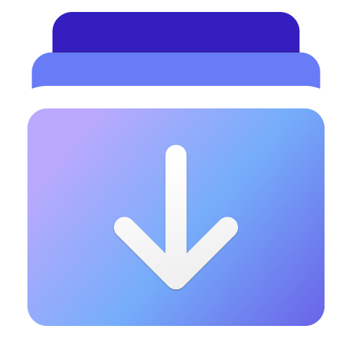

<a name="readme-top"></a>

<div align="center">



<h1 align="center">模型易取</h1>

一个专用的AI模型文件下载器，可以稳定可靠地从 [Hugging Face](https://huggingface.co) 和 [Civitai](https://civitai.com) 中下载你喜欢的模型。它支持命令行和用户界面，目前只在 Windows 上可用。

[English](./README.md) · 简体中文

<!-- SHIELD GROUP -->

[![][github-release-shield]][github-release-link]
[![][github-releasedate-shield]][github-releasedate-link]
[![][github-contributors-shield]][github-contributors-link]
[![][github-forks-shield]][github-forks-link]
[![][github-stars-shield]][github-stars-link]
[![][github-issues-shield]][github-issues-link]
[![][github-license-shield]][github-license-link]

</div>

> \[!WARNING]
>
> 该应用程序是基于 .NET 8 开发的，它不是一个跨平台的应用程序，目前只在 **Windows** 上可用。对于Windows 10 19043 以下的用户，请使用命令行，而不是用户界面。

<details>
<summary><kbd>目录</kbd></summary>

#### TOC

- [✨ 功能概览](#-功能概览)
  - [`1` 命令行 \& 用户界面](#1-命令行--用户界面)
  - [`2` 内置 Aria2](#2-内置-aria2)
- [🎛️ 环境支持](#️-环境支持)
- [🛠️ 命令行说明书](#️-命令行说明书)
    - [`1` 下载及安装](#1-下载及安装)
    - [`2` 下载 Hugging Face 模型](#2-下载-hugging-face-模型)
    - [`3` 下载魔搭社区模型](#3-下载魔搭社区模型)
    - [`4` 下载 Civitai 模型](#4-下载-civitai-模型)
    - [`5` 断点续传](#5-断点续传)
    - [`6` 配置文件](#6-配置文件)
- [🪄 应用说明书](#-应用说明书)
    - [`1` 下载及安装](#1-下载及安装-1)
    - [`2` 配置](#2-配置)
    - [`3` 下载模型](#3-下载模型)
- [🔗 链接](#-链接)

####

</details>

## ✨ 功能概览

### `1` 命令行 & 用户界面

这款应用以 aria2 为核心，提供了两种使用模式：

- 命令行
- 用户界面

这满足了不同用户的需求。

无论是命令行还是用户界面，都支持简单的本地化（支持 `en-US` 和 `zh-CN` ），并且可以根据当前系统语言自动切换。

> \[!TIP]
>
> 用户界面基于 Windows App SDK，要求你的系统版本为 Windows 10 19043 及以上。强烈建议从 Microsoft Store 下载和安装。

<p align="left">
  <a title="从 Microsoft Store 中获取" href="https://www.microsoft.com/store/apps/9PJDBLQ239JB?launch=true&mode=full" target="_blank">
    <picture>
      <source srcset="https://get.microsoft.com/images/zh-CN%20light.svg" media="(prefers-color-scheme: dark)" />
      <source srcset="https://get.microsoft.com/images/zh-CN%20dark.svg" media="(prefers-color-scheme: light), (prefers-color-scheme: no-preference)" />
      
    </picture>
  </a>
</p>

### `2` 内置 Aria2

说实话，构建这个工具的唯一动机是我找不到一个方便、可靠的下载工具来从 Hugging Face 下载整个仓库。要么没有进度指示，要么鲁棒性太差。

我的技术能力比较一般，[aria2](https://github.com/aria2/aria2) 在过去给我留下了很好的印象，所以我选择基于它构建一个简单的下载工具。

项目具有以下特性：

1. 可定制的下载目录
2. 支持断点续传
3. 完整的进度显示
4. 能够对单个项目进行操作，暂停/恢复/取消 **（仅限应用程序）**

无论是 CLI 还是 APP，都内置了 `1.3.7` 版本的 **aria2c.exe** ，无需额外下载，尽可能地做到即插即用。

## 🎛️ 环境支持

|||
|-|-|
|开发框架|.NET 8|
|UI 框架|Windows App SDK 1.5|
|系统要求|`CLI`: Windows 7 及以上, `APP`: Windows 10 19043 及以上|

## 🛠️ 命令行说明书

#### `1` 下载及安装

> \[!WARNING]
>
> CLI 依赖 .NET 8 框架，请确保你的设备上安装了 .NET 8 Desktop Runtime 或 SDK。
> 你可以在 [下载 .NET 8.0](https://dotnet.microsoft.com/zh-cn/download/dotnet/8.0) 中下载 .NET SDK 或者 .NET Desktop Runtime。

1. 从仓库的 Release 列表中下载最新的 `AIDownloader-CLI.zip` 文件。
2. 将下载的包解压到你喜欢的文件夹。
3. 将解压后的目录添加到系统或用户的 **PATH** 环境变量中。
4. 打开你熟悉的命令行，输入 `ai-downloader`。

#### `2` 下载 Hugging Face 模型

> \[!TIP]
>
> 如果想要使用此工具从Hugging Face下载模型，你需要提前准备好你的访问令牌。具体获取方法可以参考：[User Access Tokens](https://huggingface.co/docs/hub/security-tokens)

1. 选择 `Hugging Face`
2. 输入你需要下载的模型 ID。
3. 输入 Hugging Face 的访问令牌。
4. 选择 Hugging Face 模型的来源，可以选择官方源或中国的镜像站点。
5. 输入保存模型的文件夹。

> \[!TIP]
>
> 模型 ID 的格式如：`作者/模型`，例如，如果你想要下载 Llama 3 8B 模型，你需要输入的模型 ID 是：`meta-llama/Meta-Llama-3-8B` 。应用程序会根据这个 ID 和你的令牌访问 Hugging Face API 获取模型下载列表。

> \[!WARNING]
>
> "保存文件夹"的意思是存储模型的父文件夹。应用程序会在这个文件夹内创建一个与模型名称相同的子文件夹，作为存储模型文件的目录。
> 
> 例如，你指定 `C:\MyFolder` 作为保存文件夹，那么在你下载了 Llama 3 8B 模型后，实际的模型文件夹路径是 `C:\MyFolder\Meta-Llama-3-8B`。

如果一切顺利，你现在可以从模型仓库获取文件列表。请根据命令行提示选择你需要下载的文件（默认全选）。

然后，按下`Enter`键，等待下载。

*在下载过程中，你可以随时按 `Ctrl` + `C` 停止下载。*

#### `3` 下载魔搭社区模型

[魔搭（Model Scope）](https://www.modelscope.cn/) 是中国新兴的模型社区，对标 Hugging Face，所以它的下载方式和 Hugging Face 基本一致。

> \[!TIP]
>
> 魔搭的访问令牌不是必须的，但如果你要访问有权限保护的模型仓库，那么你需要提供 [访问令牌](https://www.modelscope.cn/my/myaccesstoken)。

#### `4` 下载 Civitai 模型

> \[!TIP]
>
> 与Hugging Face类似，Civitai也需要访问令牌（*但这不是必需的，只有在访问需要授权下载的某些模型时才需要*）。关于如何获取访问令牌的信息，请参考文档：[Civitai's Guide to Downloading via API](https://education.civitai.com/civitais-guide-to-downloading-via-api/)

1. 选择 **Civitai**。
2. 输入模型 ID（数字）或模型页面的链接（应用程序将提取模型 ID）。
3. 输入令牌，可选的，按回车键跳过。
4. 输入您需要保存的文件夹。

> \[!WARNING]
>
> 与 Hugging Face 不同，Civitai 通常下载单个模型文件，因此无需创建新的子文件夹，应用程序将直接将模型下载到指定的目录。

一旦上述配置准备就绪，应用程序将尝试检索指定模型的版本列表。

如果版本数量超过1，则您将看到一个版本列表，从中可以选择需要下载的模型版本。

如果指定版本的可下载文件数量超过1，则您将看到一个文件列表，选择需要下载的文件（默认全部选中）。

接下来，按 `Enter` 键等待下载完成！

#### `5` 断点续传

该应用程序基于 aria2，因此具有断点续传的能力。下载进度的管理和恢复由 aria2 控制。

如果由于某种原因，你中断了下载。

恢复也很简单，只需再次运行它。

确保你的模型ID和保存路径与之前相同。

> \[!TIP]
>
> 断点续传的基础是你还保留有上次下载的文件，以及同一目录下的后缀为 `.aria2` 的二进制文件，这些文件保存了你的下载进度。
> 
> 如果相应的文件被删除，你需要重新下载。

#### `6` 配置文件

每次重复输入可能会相当麻烦。CLI 支持使用配置文件来固定可选参数，简化每次调用时的输入。

你可以在 CLI 目录中创建一个 config.json 文件，然后将以下代码粘贴到文件中，修改属性。

```json
{
  "hf_token": "",
  "hf_save_folder": "",
  "hf_backup_folders": {
    "folder1": "path1",
    "folder2": "path2"
  },
  "hf_uri_type": "{official} or {mirror}",

  "civitai_token": "",
  "civitai_save_folder": "",
  "civitai_backup_folders": {
    "folder1": "path1",
    "folder2": "path2"
  },

  "ms_token": "",
  "ms_save_folder": "",
  "ms_backup_folders": {
    "folder1": "path1",
    "folder2": "path2"
  }
}
```

1. `*_token`  
   这是对应服务的访问令牌。其中，`hf` 指 Hugging Face，`ms` 指魔搭（Model Scope）
2. `*_save_folder` 和 `*_backup_folders`  
   这是一对互斥的属性，应用优先使用 `*_save_folder`。  
   - 如果你下载的模型只会保存在某个特定的文件夹中，那么填写 `*_save_folder`，CLI 会将对应服务的模型下载到这个文件夹。
   - 如果你有多个可选的位置，比如下载 SD-WebUI 所需的模型（check point，lora...），你可以将对应的路径填写到 `*_backup_folders` 中，其中 `key` 是文件夹路径的可读名称，`value` 是其绝对路径。运行 CLI 时，你可以从定义的文件夹列表中选择。

## 🪄 应用说明书

#### `1` 下载及安装

强烈建议从微软应用商店安装，后续可以自动更新。

<p align="left">
  <a title="从 Microsoft Store 中获取" href="https://www.microsoft.com/store/apps/9PJDBLQ239JB?launch=true&mode=full" target="_blank">
    <picture>
      <source srcset="https://get.microsoft.com/images/zh-CN%20light.svg" media="(prefers-color-scheme: dark)" />
      <source srcset="https://get.microsoft.com/images/zh-CN%20dark.svg" media="(prefers-color-scheme: light), (prefers-color-scheme: no-preference)" />
      
    </picture>
  </a>
</p>

你也可以使用侧加载的方式手动安装：

1. 打开系统设置，依次选择 `系统` -> `开发者选项`，打开 `开发人员模式`。滚动到页面底部，展开 `PowerShell` 区块，开启 `更改执行策略...` 选项
2. 打开 [Release](https://github.com/Richasy/AIDownloader/releases) 页面
3. 在最新版本的 **Assets** 中找到应用包下载。命名格式为：`AIDownloader_{version}_{arch}.zip`
4. 下载应用包后解压，右键单击文件夹中的 `install.ps1` 脚本，选择 `使用 PowerShell 运行`

#### `2` 配置

在第一次启动应用时，应用会引导你进行一些配置，包括填写 `Hugging Face`, `Civitai`, `魔搭` 等服务的令牌，以及对应服务的保存文件夹等。

如果你不需要对应的服务，直接点击下一步跳过配置即可。

所有的初始配置，后续都可以在应用设置页面更改。

#### `3` 下载模型

打开应用后，你可以在顶部右侧的导航栏中切换不同的模型托管服务。

点击 `下载模型` 按钮，将会弹出对应服务的下载对话框。

根据提示，输入模型的 Id，并选择保存文件夹。你也可以点击 `选择其它` 来临时选择一个文件夹存放。

之后，就可以查看对应仓库的文件列表，选择需要下载的文件，点击下载即可。

应用会逐个添加下载任务，你可以在界面上实时观察到下载进度及下载速度。

你可以随时暂停或恢复某个任务。

> \[!WARNING]
>
> 和一般下载器不同的是，应用不会保留你的历史记录。

> 如果你因为某种原因关闭了正在下载的任务，别担心，你仍然可以恢复下载进度，只是需要重新创建一个相同的下载任务（相同的服务，相同的模型 ID，相同的保存路径）。
> 
> 在这一点上，应用是有记录的，当你再次创建下载任务时，应用会沿用你上一次的下载配置。

## 🔗 链接

- [Spectre.Console](https://spectreconsole.net)
- [Windows App SDK](https://github.com/microsoft/WindowsAppSDK)
- [aria2](https://github.com/aria2/aria2)
- [Aria2.NET](https://github.com/rogerfar/Aria2.NET)
- [CommunityToolkit](https://github.com/CommunityToolkit)
- [Hugging Face](https://huggingface.co)
- [Hugging Face Mirror](https://hf-mirror.com)
- [Civitai](https://civitai.com)
- [魔搭](https://www.modelscope.cn)

<!-- LINK GROUP -->
[github-contributors-link]: https://github.com/Richasy/AIDownloader/graphs/contributors
[github-contributors-shield]: https://img.shields.io/github/contributors/Richasy/AIDownloader?color=c4f042&labelColor=black&style=flat-square
[github-forks-link]: https://github.com/Richasy/AIDownloader/network/members
[github-forks-shield]: https://img.shields.io/github/forks/Richasy/AIDownloader?color=8ae8ff&labelColor=black&style=flat-square
[github-issues-link]: https://github.com/Richasy/AIDownloader/issues
[github-issues-shield]: https://img.shields.io/github/issues/Richasy/AIDownloader?color=ff80eb&labelColor=black&style=flat-square
[github-license-link]: https://github.com/Richasy/AIDownloader/blob/main/LICENSE
[github-license-shield]: https://img.shields.io/github/license/Richasy/AIDownloader?color=white&labelColor=black&style=flat-square
[github-release-link]: https://github.com/Richasy/AIDownloader/releases
[github-release-shield]: https://img.shields.io/github/v/release/Richasy/AIDownloader?color=369eff&labelColor=black&logo=github&style=flat-square
[github-releasedate-link]: https://github.com/Richasy/AIDownloader/releases
[github-releasedate-shield]: https://img.shields.io/github/release-date/Richasy/AIDownloader?labelColor=black&style=flat-square
[github-stars-link]: https://github.com/Richasy/AIDownloader/network/stargazers
[github-stars-shield]: https://img.shields.io/github/stars/Richasy/AIDownloader?color=ffcb47&labelColor=black&style=flat-square